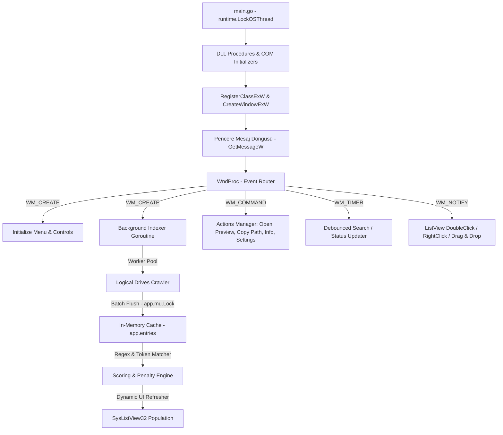

# QBFind

[](https://golang.org)
[](LICENSE)
[](https://microsoft.com)

**QBFind** is a high-performance, single-executable desktop file finder built specifically for Microsoft Windows. It leverages raw **Win32 API** calls and **COM/OLE** interfaces directly from Go without Cgo or third-party GUI dependencies, achieving an extremely small footprint and fast startup times.

---

## ⚡ Key Features

*   **Zero Dependencies**: Uses pure Go with raw Windows DLL procedure bindings (`user32`, `kernel32`, `gdi32`, `comctl32`, `shell32`, `ole32`). No heavy external GUI libraries or runtime frameworks.
*   **Parallel Multi-Threaded Scanning**: Implements a high-performance concurrent worker pool dynamically sized based on the CPU cores:
    $$\text{Workers} = \min(\max(\text{NumCPU} \times 2, 2), 16)$$
    Tars userspace paths (`Desktop`, `Downloads`, `Documents`, etc.) first to ensure instantaneous query availability upon startup.
*   **Low-Level COM/OLE Drag & Drop**: Implements standard `IDataObject`, `IDropSource`, and `IEnumFORMATETC` interfaces in pure Go by manually constructing COM virtual method tables (VTables). Drag files directly from QBFind and drop them onto Windows Explorer, Chrome, VS Code, etc.
*   **Intelligent Scoring & Ranking Engine**: Sorts search results using a comprehensive ceza/ödül (penalty/reward) scoring algorithm based on path depth, folder priority, executable extensions, and Turkish character folding (`ı, İ, ç, ğ, ö, ş, ü` mappings).
*   **In-App Metin Preview**: Decodes UTF-8, UTF-16LE, and UTF-16BE files dynamically with Byte Order Mark (BOM) validation, displaying raw text previews up to 4,000 characters in native Win32 message boxes.
*   **Multilingual Support**: Real-time language switching between English and Turkish, with persistent configurations saved under `%APPDATA%/QBFind/settings.txt`.

---

## 🏗️ Architectural Overview

The application is structured around a central event routing main loop connected to concurrent disk scanners and in-memory scoring query filters:



---

## 📂 Modular File Walkthrough

To maintain clean architecture, the codebase is modularized as follows:

| Filename | Responsibility |
| :--- | :--- |
| **`quickfind.go`** | Entrypoint (`main`), Win32 style constants, DLL proc loaders, Win32 structs, and global variables. |
| **`ui.go`** | Native `wndProc` routing, child controls creation, layout constraints (`layoutControls`), and dialog popups. |
| **`listview.go`** | Column definitions, selection mapping, double-click/right-click handlers, context menu, and row insertion. |
| **`search.go`** | Debounced search trigger, Turkish text normalization (`searchFold`), token splitting, extension extraction, and the ceza/ödül ranking algorithm (`scoreEntry`). |
| **`indexer.go`** | Concurrent logical drive scanning worker pool, junction/reparse point validation, prioritizer (`entryPriority`), and folders filter. |
| **`ole.go`** | Low-level COM interface simulation (VTables), drag-and-drop (`DoDragDrop`), and global memory helpers. |
| **`settings.go`** | Persistent configurations cache, English/Turkish string translation registers, and dynamic translation refreshes. |
| **`actions.go`** | Native execution triggers (`ShellExecuteW`), desktop copies (`SHFileOperationW`), and metadata previews with BOM-checking decoders. |
| **`utils.go`** | String transformations (`utf16Ptr`, `utf16Multi`), numeric formatting (`formatInt`), clipboard writers, and bitwise macros (`loword`, `hiword`, `xFromLParam`, `yFromLParam`). |

---

## 🛠️ Compilation & Execution

Ensure you have **Go 1.18 or higher** installed.

### Run in Development
```powershell
go run .
```

### Production Release Build
To compile a optimized standalone `.exe` without attaching an external console shell terminal window in Windows:
```powershell
go build -ldflags "-s -w -H windowsgui" -o QBFind.exe
```
#### Flag Descriptions:
*   `-s -w`: Strips debug information and symbols to drastically decrease executable size (~3MB).
*   `-H windowsgui`: Prevents a blank Windows command-prompt terminal window from displaying behind the GUI.

---

## 📄 License
This project is licensed under the MIT License - see the [LICENSE](LICENSE) file for details.
